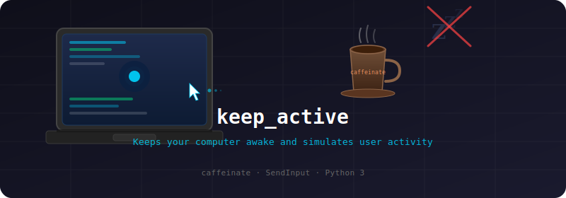

# keep_active



Prevents your computer from sleeping and simulates mouse activity at a configurable interval. Useful for keeping sessions alive (SSH, meetings, CI dashboards, etc.) when you need to step away. Works on **macOS** and **Windows**.

## How it works

**macOS**

- Runs `caffeinate` in the background to block display and system sleep.
- Every N seconds, moves the mouse cursor one pixel and back using CoreGraphics — enough to register as user activity without visibly moving the pointer.

**Windows**

- Calls `SetThreadExecutionState` so the system and display stay available while the script runs.
- Every N seconds, sends a tiny relative mouse move via `SendInput` and moves it back.

On both systems, each simulated activity is logged with a timestamp, and sleep prevention is cleared when you stop the script.

## Requirements

- **macOS** or **Windows** (64-bit)
- **Python 3** (pre-installed on modern macOS; install from [python.org](https://www.python.org/downloads/) on Windows if needed)
- No third-party Python packages

## Usage

**macOS or Git Bash (same arguments as before)**

```bash
# Make executable (first time only)
chmod +x keep_active.sh

# Run with default interval (60 seconds)
./keep_active.sh

# Custom interval (e.g. every 30 seconds)
./keep_active.sh 30
```

**Any platform (recommended on Windows)**

```bash
python3 keep_active.py      # default 60s interval
python3 keep_active.py 30   # every 30 seconds
```

On Windows, `python` or `py` may be the right command depending on your install, for example:

```text
python keep_active.py 60
```

Press `Ctrl+C` to stop. Cleanup runs automatically (stops `caffeinate` on macOS, clears execution state on Windows).

## Notes

- **WSL**: This targets the desktop OS. To keep the **Windows** host awake, run the script in Windows (Command Prompt, PowerShell, or Terminal), not only inside WSL.
- **Security software**: Simulated input can trigger warnings from antivirus or endpoint protection on some corporate machines.

## Example output

```
Starting keep-active script (interval: 60s). Press Ctrl+C to stop.
Running — will simulate activity every 60 seconds.
[14:02:01] Activity simulated. Next in 60s...
[14:03:01] Activity simulated. Next in 60s...
^C
Stopping keep-active script...
```
